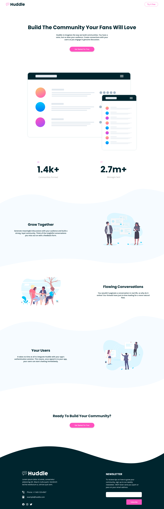

# Frontend Mentor - Huddle landing page with curved sections solution
  

This is a solution to the [Huddle landing page with curved sections challenge on Frontend Mentor](https://www.frontendmentor.io/challenges/huddle-landing-page-with-curved-sections-5ca5ecd01e82137ec91a50f2).

  

## Table of contents

  

- [Overview](#overview)

- [The challenge](#the-challenge)

- [Screenshot](#screenshot)

- [Links](#links)

- [My process](#my-process)

- [Built with](#built-with)

- [What I learned](#what-i-learned)

- [Author](#author)

  


## Overview


### The challenge

  

Users should be able to:

- View the optimal layout for the site depending on their device's screen size

  

### Screenshot

  



### Links

  

- Solution URL: [Repo:](https://github.com/Ibrahim-003/juniorProject__1)

- Live Site URL: [landing Page](https://ibrahim-003.github.io/juniorProject__1/)

  

## My process

### Built with

- Semantic HTML5 markup

- CSS custom properties

- Flexbox

- CSS Grid

- Mobile-first workflow

  

### What I learned

  

To solve the project I had to use new HTML tags as well as CSS concepts that were unknown to me, such as "custom properties", the use of media queris have also been key to being able to view the project on different devices.

  

```html
<picture>
                    <source media="(ming-width:1024px" srcset="./images/bg-section-top-desktop-2.svg">
                    <source media='(min-width: 768px)' srcset="./images/bg-section-top-desktop-1.svg">
                    <source media="(min-width:600px)" srcset="./images/bg-section-top-mobile-2.svg">
                    
</picture>
```

```css

:root {
    --pink: hwb(322 32% 0%);
    --ligth-pink: hsl(321, 100%, 78%);
    --light-red: hsl(0, 100%, 63%);
    --Very-dark-cyan: hsl(192, 100%, 9%);
    --Very-pale-blue: hsl(207, 100%, 98%);
    --primary-font_family: 'Open Sans';
    --secondary-font_family: Poppins;
    --header-height: 3.5rem;
    --h1-font-size: clamp(1.5rem, 5vw, 3rem);
    --h2-font-size: clamp(1.25rem, 3vw, 2rem);
    --h4-font-size: clamp(.865rem, 3vw, 1.125rem);
    --little-white: #fff;
}

```

  

## Author

  
- Ibrahim Almeyda

- Frontend Mentor - [@Ibrahim-003](https://www.frontendmentor.io/profile/Ibrahim-003)
  
